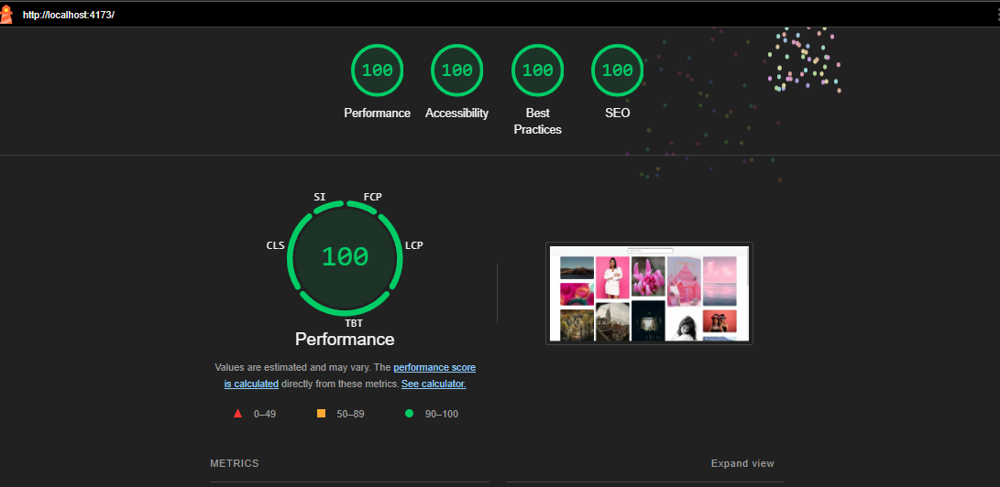

# Pexels Gallery App


## Tools

### Redux
Redux is used for managing the global state of our application. The decision to use Redux was based on the need for:

1. **Centralized Store**: We can have a centralized store that can be accessed by multiple components, such as the search component and hooks.
2. **State Persistence**: We can persist the state so that when we navigate back from the details page, the previous state is seamlessly maintained for the user.

### Axios
Axios is used for making HTTP requests to the Pexels API. We chose Axios because:

- **Promise-based API**: Axios offers a promise-based API that's simpler and more concise compared to the Fetch API, reducing boilerplate code for handling requests and responses.
- **Automatic JSON Parsing**: Axios automatically parses JSON responses, so we don't need to manually handle response.json(), streamlining API calls.
- **Error Handling**: Axios provides better error handling out of the box, with clear support for interceptors, making it easier to handle request and response errors globally.


### React Router
React Router is used for navigation within the application

### Styled-components
Styled-components is a CSS-in-JS library used for styling our React components. 


## Installation

1. Clone the repository:

   ```bash
   git clone https://github.com/Lyos95/optimized-masonry-grid.git
   cd optimized-masonry-grid
   ```
2. Install dependencies:

    ```
    npm install
    ```
3. Configure Environment Variables:

- Copy the example environment file and rename it to `.env`:
- Update the `.env` file with your specific values setting the `VITE_API_KEY`:

    ```
    VITE_API_KEY=your_api_key_here
    ```

## Running the App (Local Build)

To start the development server:

```
npm run dev
```

Visit:

```
http://localhost:5173/
```

## Running the App (Production Build)

To start the development server:

```
npm run build
npx vite preview
```

Visit:

```
http://localhost:4173/
```

The production build will be optimized using the following Vite configuration:

```
// vite.config.js
minify: 'terser',
terserOptions: {
  compress: {
    drop_console: true,
    drop_debugger: true,
    passes: 3,
  },
  mangle: true,
},
cssCodeSplit: true,
```

  - **Minification**: Using Terser for minification to reduce the bundle size. The options drop_console and drop_debugger remove console logs and debugger statements from the production code.
  - **Passes: The passes**: 3 option allows Terser to run three passes of optimizations, resulting in a smaller and more efficient bundle.
  - **CSS Code Splitting**: helps split CSS into separate files to avoid loading unnecessary styles.
  - **Mangle:**
    - **Reduced Bundle Size**: Shortening variable and function names reduces the overall size of the JavaScript bundle, which helps improve load times, especially on slower networks.
    - **Obfuscation**: While not its primary purpose, mangling also makes the code less readable, providing a minor layer of obfuscation against reverse engineering.
    - **Performance Improvement**: A smaller bundle size leads to faster parsing and execution times in the browser, enhancing the overall performance of the application.


## Performance Optimizations



- **Virtualization**: The gallery uses Virtualization to only render visible images, preventing excessive DOM nodes and improving performance.

- **Responsive Images**: The app loads different image resolutions based on screen size:
  - **Mobile**: Medium-sized images for smaller screens.
  - **Desktop**: Larger images for better clarity on bigger screens.

- **Infinite Scroll**: Chosen for a smooth user experience, allowing continuous loading without the need for pagination.

- **Skeleton Loading**: Displays skeleton placeholders while fetching images to prevent layout shifts.

- **Listener Cleanup**: Removed event listeners when no longer needed to avoid memory leaks and performance degradation.

## Usability and Accessibility

- **ARIA Labels**: Added ARIA labels and appropriate HTML tags for better screen reader support.

- **Alt Attributes**: Provided meaningful `alt` attributes for all images, enhancing accessibility for visually impaired users.
